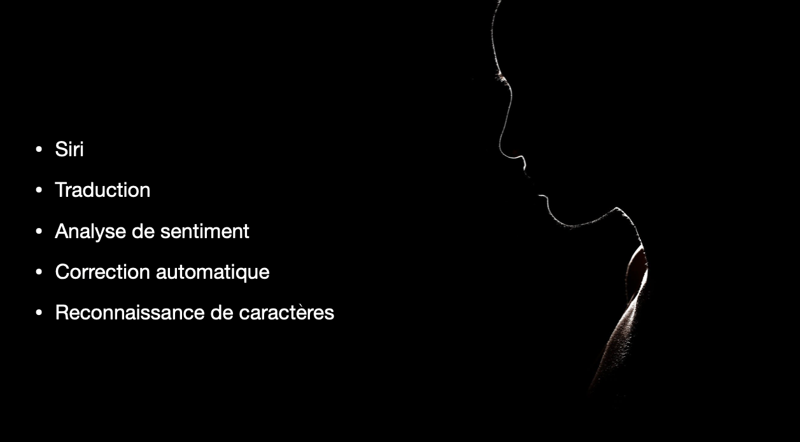
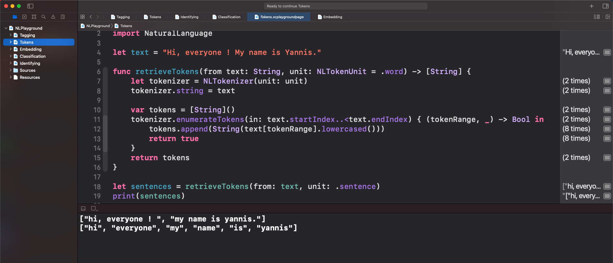

# Swift Introduction to Natural Language Processing

  

  

## Ressources 
| Name | Link |
| ------ | ------ |
| Keynote | [NaturalLanguageProcessingKeynote.pdf](./NaturalLanguageProcessingKeynote.pdf) |
| Playground (5 Pages) | [NLPlayground.playground](./NLPlayground.playground) |

## NL Features

- Cleaning
- Tokenisation
- Stemming 
- Lemmatisation
- Word Embedding

> Simple Swift Introduction to Natural Language Processing for Educational purposes
